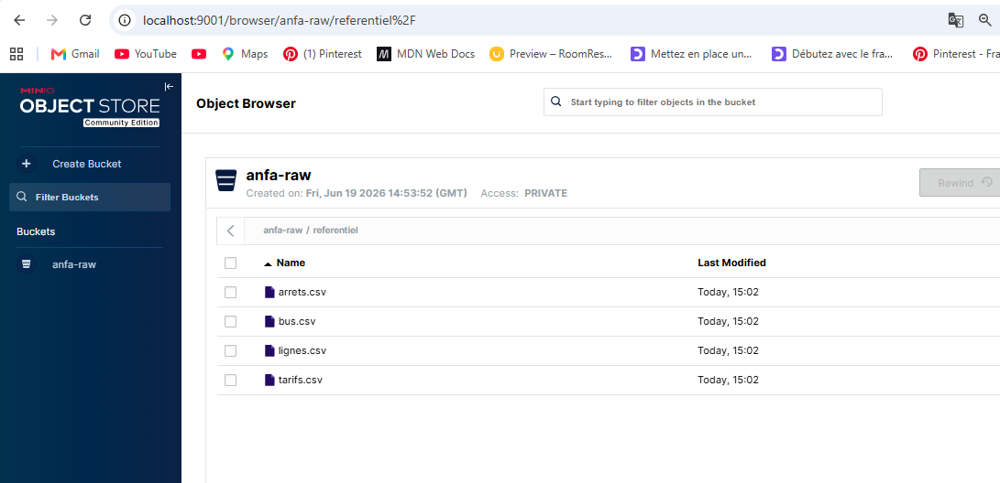

# Rendu Séance 1

**Nom et prénom :** **ADEOUL Koffi Prosper**
## Résumé de la séance
Cette première séance a permis de mettre en place la fondation de l'architecture de la plateforme de données Anfa. Nous avons configuré un environnement de stockage objet local en déployant une instance MinIO via Docker Compose, puis nous avons automatisé l'ingestion de fichiers de données brutes (référentiel transport) à l'aide d'un script Python exploitant la bibliothèque `boto3` (compatible AWS S3).

## Étapes principales
1. **Initialisation Git** : Fork du dépôt d'origine, clonage local et création de la branche de travail `seance-01`.
2. **Déploiement de l'Infrastructure** : Création d'un volume Docker persistant et écriture d'un fichier `docker-compose.yml` pour orchestrer le conteneur MinIO.
3. **Configuration de MinIO** : Utilisation du client en ligne de commande `mc` à l'intérieur du conteneur pour configurer un alias, créer le bucket de zone brute `anfa-raw`, et générer une paire de clés d'accès applicatives sécurisées.
4. **Automatisation de l'Ingestion** : Écriture et exécution du script Python `upload_referentiel.py` pour téléverser automatiquement le référentiel des lignes, arrêts, bus et tarifs dans MinIO.

## Capture d'écran

## Difficultés rencontrées
**Les caractères d'échappement de fin de ligne (`\`) prévus pour Linux dans le sujet de TP ont provoqué des erreurs dans le terminal PowerShell, résolues par l'utilisation directe de Docker Compose.

---
## Exercices d'application
### Exercice 1 : QCM conceptuel
**1.1-**
   * **Réponse :** D. Open source obligatoire
   * **Justification :** Le NIST définit essentiellement 5 caractéristiques clés (Élasticité, Service mesuré, Mutualisation, Libre-service, Accès réseau large).

**1.2-**
   * **Réponse :** C. SaaS
   * **Justification :** Gmail est une application clé en main entièrement gérée par le fournisseur et accessible directement par l'utilisateur final sans gestion d'infrastructure ou de plateforme.

**1.3- Le modèle de service le plus adapté est:**
   * **Réponse :** D. FaaS (Function as a Service)
   * **Justification :** Le FaaS (Serverless) est idéal pour les architectures orientées événements (comme la réception de coordonnées GPS), car le code ne s'exécute et n'est facturé qu'au déclenchement exact de l'événement.

**1.4- Le modèle de déploiement le plus adapté est: **
   * **Réponse :** C. Cloud hybride
   * **Justification :** Le cloud hybride permet de conserver les données hautement sensibles et réglementées au sein d'un cloud privé (on-premise) tout en externalisant les traitements lourds non sensibles vers un cloud public élastique.

**1.5- Le vendor lock-in est:**
   * **Réponse :** B. La situation où une entreprise ne peut plus changer de fournisseur sans coûts ou risques majeurs
   * **Justification :** Le vendor lock-in désigne la forte adhérence technique ou financière à des technologies propriétaires qui rend la migration vers un concurrent extrêmement complexe.

**1.6- La réponse fausse est:**
   * **Réponse :** C. Un service open source est forcément moins performant qu'un service managé propriétaire
   * **Justification :** C'est faux car les outils open source comme Apache Spark ou Kafka affichent des performances exceptionnelles à l'échelle industrielle et constituent souvent le cœur même des services managés des grands fournisseurs cloud.

---

### Exercice 2 : Classification de services

| Service | Modèle | Justification |
| :--- | :--- | :--- |
| **Google Compute Engine** | IaaS | Fournit des ressources de bas niveau (machines virtuelles brutes) où l'utilisateur gère l'OS et les applications. |
| **AWS Lambda** | FaaS | Permet d'exécuter du code à la demande à la suite d'événements spécifiques, sans gérer de serveurs sous-jacents. |
| **Snowflake** | SaaS | Entrepôt de données entièrement managé où l'utilisateur consomme directement le service via SQL sans gérer l'infrastructure ou le scaling. |
| **Heroku** | PaaS | Offre un environnement prêt à l'emploi permettant aux développeurs de déployer leurs applications sans se soucier des serveurs. |
| **Microsoft 365** | SaaS | Suite applicative bureautique prête à l'emploi, hébergée et directement consommable par les utilisateurs finaux. |
| **Databricks** | PaaS / SaaS | Fournit une plateforme de calcul managée optimisée pour Spark, libérant l'utilisateur de la configuration de clusters complexes. |
| **Microsoft Azure Functions** | FaaS | Service de calcul serverless d'Azure permettant d'exécuter du code événementiel à la milliseconde. |
| **Tableau Online** | SaaS | Solution d'informatique décisionnelle (BI) et de visualisation de données entièrement hébergée et accessible via un navigateur. |

---

### Exercice 3 : Lecture et interprétation

#### 3.1 Commande docker run
* **Détails des options :**
  * `-d` : Mode détaché, exécute le conteneur en arrière-plan et libère l'invite de commande du terminal.
  * `--name analyse-anfa` : Assigne un nom personnalisé et unique au conteneur pour l'identifier facilement au lieu d'un ID généré aléatoirement.
  * `-p 8888:8888` : Redirige le port 8888 de la machine hôte vers le port 8888 à l'intérieur du conteneur.
  * `-v /home/koffi/notebooks:/notebooks` : Monte un volume pour lier le dossier local `/home/koffi/notebooks` au dossier `/notebooks` du conteneur, assurant la persistance des fichiers.
  * `-e JUPYTER_TOKEN=anfa-token` : Injecte une variable d'environnement définissant le mot de passe/jeton de sécurité pour accéder à l'interface Jupyter.
  * `jupyter/pyspark-notebook` : Nom de l'image officielle à télécharger depuis Docker Hub pour instancier le conteneur.
* **Explication globale :** Cette commande télécharge et lance en arrière-plan un environnement Jupyter intégrant PySpark, accessible de manière sécurisée via le port 8888. Elle assure la persistance du travail en liant un répertoire local de l'hôte au système de fichiers du conteneur.

#### 3.2 Lecture d'un docker-compose.yml
* **a. Adresses d'accès (URL) :** L'API de stockage MinIO est accessible sur `http://localhost:9000` et la console web d'administration graphique est accessible sur `http://localhost:9001`.
* **b. Persistance des données :** **Non, les données ne sont pas perdues.** Le conteneur s'appuie sur un volume Docker nommé `minio-data` déclaré de manière indépendante. La suppression du conteneur n'affecte pas le volume qui sera simplement rattaché au nouveau conteneur lors du redémarrage.
* **c. Problème de sécurité :** Le mot de passe racine (`secret`) est écrit en clair directement dans le fichier de configuration (hardcoded credential) et sa politique de complexité est trop faible pour de la production. Il faudrait utiliser des variables d'environnement externes ou un gestionnaire de secrets.

---

### Exercice 4 : Diagnostic

* **a. Cause précise de l'erreur :** L'étudiant utilise les identifiants d'administration généraux de MinIO (`anfa-admin` / `anfa-password-2026`) au lieu d'exploiter la paire de clés d'accès applicatives (Service Account Access Keys) spécifiquement générée avec le client `mc`.
* **b. Correction du code :** Il faut remplacer les valeurs des identifiants par les clés applicatives créées générée avec le client **mc**.
* **c. c. Refus des identifiants admin : MinIO dissocie par sécurité les comptes d'accès d'administration humaine des accès programmatiques. L'accès à l'API via le client boto3 exige l'authentification stricte par un compte de service applicatif disposant des politiques d'accès adéquates.**

### Exercice 5 : Mini-cas d'architecture
#### a. Deux limites concrètes de l'architecture actuelle :

* Absence de fraîcheur des données : L'export mensuel au format CSV empêche toute analyse ou prédiction en temps réel (ou horaire) exigée par la direction.

* Indisponibilité et non-scalabilité : Les calculs dépendent entièrement des performances matérielles d'un ordinateur portable unique, bloquant le partage des résultats et l'augmentation des capacités de calcul lors des pics de charge.

#### b. Correspondance avec les caractéristiques du cloud (NIST) :

* Prédictions en quasi temps réel -> Accès réseau large : Permet l'ingestion continue et fluide de flux de données depuis n'importe quel point du réseau.

* Tableau de bord partagé sans installation locale -> Libre-service à la demande : Les analystes peuvent provisionner et accéder aux outils visuels immédiatement via le web.

* Augmenter la capacité de calcul lors des pics -> Élasticité rapide : Permet d'allouer dynamiquement de la puissance CPU/RAM supplémentaire pendant les pics d'achat du vendredi soir, puis de la réduire.

* Maîtriser les coûts -> Service mesuré : L'entreprise ne paye l'infrastructure que pour les ressources consommées à la minute ou à l'heure, sans investissement lourd initial.

#### c. Modèles de services cibles :

(i) **Tableau de bord partagé :** SaaS (ex: Tableau Online, Power BI Service) car il offre un outil analytique web collaboratif immédiat, sans gestion logicielle.

(ii) **Calcul des prédictions à l'heure :** FaaS (ex: AWS Lambda) ou PaaS (ex: Databricks) car cela permet d'exécuter l'algorithme lourd de prédiction de manière ponctuelle chaque heure sans maintenir de serveurs actifs 24h/24.

(iii) **Stockage des données clients :** IaaS ou PaaS (ex: Base de données managée type PostgreSQL / S3) pour garder la maîtrise fine de la configuration de sécurité, du chiffrement et de la localisation des fichiers.

#### d. Modèle de déploiement recommandé : 
Un modèle de Cloud Hybride est idéal. Il permet d'héberger la base de données clients hautement confidentielle sur un serveur local ou un cloud privé souverain au Togo (pour des raisons de conformité), tout en connectant ponctuellement ces données à un cloud public pour exploiter sa puissance de calcul élastique lors des prédictions de demande.

#### e. Trois stratégies concrètes contre le vendor lock-in :

* Utilisation exclusive de briques Open Source : Déployer des technologies standardisées et portables (comme Apache Spark, Kafka, MinIO et PostgreSQL) qui s'exécutent de manière identique chez n'importe quel fournisseur cloud.

* Conteneurisation systématique : Packager les modèles et les scripts du data scientist dans des conteneurs Docker pour garantir qu'ils puissent migrer d'un environnement à un autre instantanément.

* Adopter l'Infrastructure as Code (IaC) : Utiliser des outils neutres comme Terraform pour décrire l'architecture de manière logicielle, facilitant ainsi la réplication complète de l'infrastructure chez un autre hébergeur en cas de besoin.