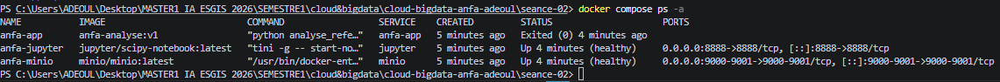
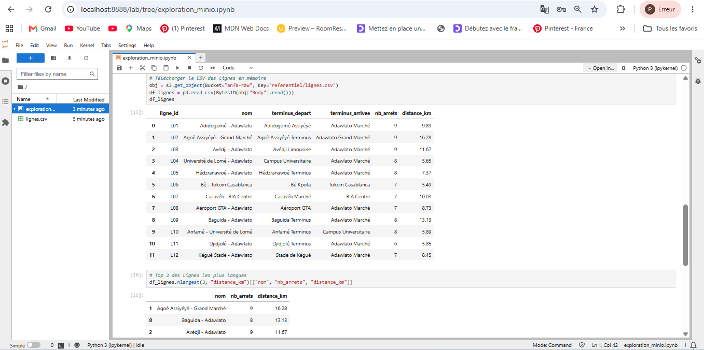

# RENDU Séance 2

**Nom et prénom :** ADEOUL Koffi Prosper

**Identifiant GitHub :** `<prosperadeoul-hub>`  

**Date de soumission :** 25/06/2026

---

# Résumé de la séance

Au cours de cette séance, j'ai écrit un Dockerfile pour encapsuler notre script PySpark, avant d'orchestrer une stack complète à 3 services (MinIO, Jupyter et notre application) via Docker Compose.

J'ai ensuite exploré et analysé les données stockées dans le bucket MinIO à l'aide d'un notebook Jupyter via Boto3 et Pandas, validant ainsi la communication inter-conteneurs.

---

# Étapes principales

1. Écriture du Dockerfile et construction de l'image `anfa-analyse:v1`.
2. Mise en place du fichier `.dockerignore` pour optimiser le contexte de build et exploiter efficacement le cache Docker.
3. Écriture du fichier `docker-compose.yml` pour orchestrer les services :
   - MinIO
   - Jupyter 
   - Application custom
4. Création du notebook `exploration_minio.ipynb` permettant de lire et d'afficher le Top 3 des lignes de transport les plus longues depuis le bucket `anfa-raw`.

---

# Captures d'écran

## Docker Compose



## Notebook Jupyter



---

# Bonus Multi-Stage (Optionnel)

Le build multi-stage a été réalisé avec succès à l'aide d'une image de runtime basée sur Alpine (`eclipse-temurin:17-jre-alpine`) afin de contourner des restrictions réseau locales sur les dépôts Debian standards.

- **Taille de l'image v1 :** 1.17 GB
- **Taille de l'image v2-multistage :** 1.03 GB
- **Gain obtenu :** ~12 % de réduction de taille (140 MB économisés)

---

# Réponses aux exercices d'application

## Exercice 1 : QCM conceptuel

### 1.1

**Réponse : C. Un conteneur partage le noyau de la machine hôte.**

**Justification :** Contrairement aux machines virtuelles, Docker n'embarque pas de système d'exploitation complet mais isole des processus s'exécutant directement sur le noyau Linux de l'hôte.

### 1.2

**Réponse : B. L'image est un modèle figé en lecture seule ; le conteneur est une instance en cours d'exécution.**

**Justification :** L'image sert de blueprint immuable à partir duquel Docker instancie une couche de lecture-écriture éphémère constituant le conteneur actif.

### 1.3

**Réponse : B. Les namespaces**

**Justification :** Les namespaces Linux permettent d'isoler les processus, réseaux, utilisateurs et systèmes de fichiers des conteneurs.

### 1.4

**Réponse : A. Les cgroups**

**Justification :** Les cgroups sont utilisés pour mesurer, limiter et allouer les ressources physiques telles que le CPU et la mémoire.

### 1.5

**Réponse : B. Dans une machine virtuelle Linux invisible gérée par Docker Desktop.**

**Justification :** macOS ne disposant pas d'un noyau Linux natif, Docker Desktop utilise une micro-machine virtuelle Linux.

### 1.6

**Réponse : B. La société d'origine qui a créé et open-sourcé Docker en 2013.**

**Justification :** Docker est né au sein de DotCloud sous la direction de Solomon Hykes.

### 1.7

**Réponse : C. Docker a apporté un format d'image portable, une CLI simple et un registre public, en s'appuyant sur les mêmes primitives que LXC.**

**Justification :** Docker a démocratisé l'utilisation des conteneurs grâce à une expérience développeur simplifiée.

### 1.8

**Réponse : B. Open Container Initiative**

**Justification :** L'OCI définit les standards ouverts pour les images et runtimes de conteneurs.

---

## Exercice 2 : Lecture et analyse d'un Dockerfile

### 2.1 Explication de chaque instruction

- `FROM python:3.11` : définit l'image de base.
- `WORKDIR /application` : définit le répertoire de travail.
- `COPY . /application` : copie les fichiers du projet.
- `RUN pip install -r requirements.txt` : installe les dépendances.
- `EXPOSE 5000` : documente le port utilisé.
- `CMD ["python", "main.py"]` : commande de démarrage.

### 2.2 Différence entre `EXPOSE 5000` et `-p 5000:5000`

`EXPOSE 5000` est une simple métadonnée informative.

`-p 5000:5000` ouvre réellement le port sur la machine hôte et le relie au port du conteneur.

### 2.3 Problèmes identifiés et corrections

#### Problème 1 : Mauvaise gestion du cache Docker

L'instruction `COPY .` est exécutée avant l'installation des dépendances.

**Correction :**

- Copier `requirements.txt`
- Installer les dépendances
- Copier ensuite le reste du projet

#### Problème 2 : Utilisation de root

L'application est exécutée avec les privilèges administrateur.

**Correction :**

Créer un utilisateur non privilégié puis utiliser l'instruction `USER`.

### 2.4 Dockerfile corrigé

```dockerfile
FROM python:3.11-slim

WORKDIR /application

COPY requirements.txt .
RUN pip install --no-cache-dir -r requirements.txt

RUN useradd -m appuser && chown -R appuser:appuser /application
USER appuser

COPY . .

EXPOSE 5000

CMD ["python", "main.py"]
```

---

## Exercice 3 : Diagnostic

### 3.1 Le build qui échoue

#### a. Cause

Le fichier `requirements.txt` n'existe pas encore dans le conteneur lorsque Docker exécute :

```dockerfile
RUN pip install -r requirements.txt
```

#### b. Correction

```dockerfile
FROM python:3.11-slim

WORKDIR /app

COPY requirements.txt .
RUN pip install --no-cache-dir -r requirements.txt

COPY . .

CMD ["python", "main.py"]
```

#### c. Analyse

Cette erreur montre que les couches Docker sont exécutées séquentiellement et qu'un fichier doit être copié avant de pouvoir être utilisé.

### 3.2 Le conteneur qui ne voit pas l'autre

#### a. Erreur

L'utilisation de `localhost`.

Dans Docker, `localhost` désigne le conteneur lui-même.

#### b. Correction

```yaml
DATABASE_URL: "postgresql://user:password@db:5432/anfa"
```

Le nom `db` correspond au nom du service Docker Compose.

---

## Exercice 4 : Optimisation d'image

### Problème 1 : Image de base trop lourde

Utilisation de `ubuntu:22.04` au lieu d'une image optimisée telle que :

```dockerfile
python:3.11-slim
```

### Problème 2 : Outils inutiles

Installation de :

- build-essential
- git
- curl
- wget

alors qu'ils ne sont pas nécessaires à l'exécution.

### Problème 3 : Mauvaise gestion du cache apt

Les commandes :

```bash
apt-get update
apt-get install
```

sont séparées et les caches ne sont pas supprimés.

### Problème 4 : Mauvaise gestion du cache applicatif

Le code est copié avant l'installation des dépendances.

---

## Exercice 5 : Mini-cas d'architecture

### a. Services à conteneuriser

#### ingest-job

Script Python chargé :

- d'extraire les données GPS
- de les transformer
- de les charger dans MinIO

#### minio

Stockage objet compatible S3.

#### jupyter-notebook

Exploration et analyse des données.

### b. Politique de redémarrage

```yaml
restart: "no"
```

Le script est un job batch ponctuel.

### c. Transmission d'une date au script

#### Solution 1 : Variable d'environnement

```env
TARGET_DATE=2026-06-23
```

#### Solution 2 : Argument de ligne de commande

```bash
docker compose run ingest-job python downloader.py 2026-06-23
```

#### Recommandation

Utiliser les variables d'environnement.

### d. Pourquoi séparer Jupyter du script ?

Respect du principe de responsabilité unique :

- meilleure isolation
- meilleure sécurité
- meilleure gestion des ressources

### e. Squelette du fichier docker-compose.yml

```yaml
version: "3.8"

networks:
  anfa-network:
    driver: bridge

volumes:
  minio-data:
  jupyter-notebooks:

services:
  minio:
    image: minio/minio:latest
    container_name: anfa-storage
    command: server /data --console-address ":9001"

    ports:
      - "9000:9000"
      - "9001:9001"

    volumes:
      - minio-data:/data

    networks:
      - anfa-network

  jupyter:
    image: jupyter/minimal-notebook:latest
    container_name: anfa-exploration

    ports:
      - "8888:8888"

    volumes:
      - jupyter-notebooks:/home/jovyan/work

    depends_on:
      - minio

    networks:
      - anfa-network

  ingest-job:
    build:
      context: ./ingest

    container_name: anfa-ingestion

    environment:
      - MINIO_ENDPOINT=http://minio:9000
      - TARGET_DATE=${TARGET_DATE:-LATEST}

    restart: "no"

    depends_on:
      - minio

    networks:
      - anfa-network
```

---

# Difficultés rencontrées

Une difficulté majeure a été rencontrée lors du build de l'image multi-stage à cause d'une erreur récurrente **403 Forbidden** sur l'exécution de `apt-get update` vers les serveurs Debian.

Cette difficulté a été résolue en utilisant une image basée sur Alpine incluant déjà l'environnement OpenJDK :

```dockerfile
eclipse-temurin:17-jre-alpine
```

Cette solution a permis d'éviter les appels réseau bloqués tout en réduisant la taille finale de l'image.