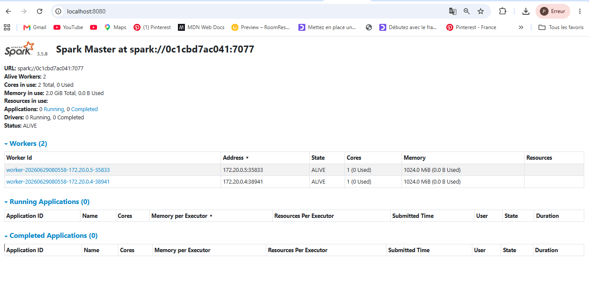
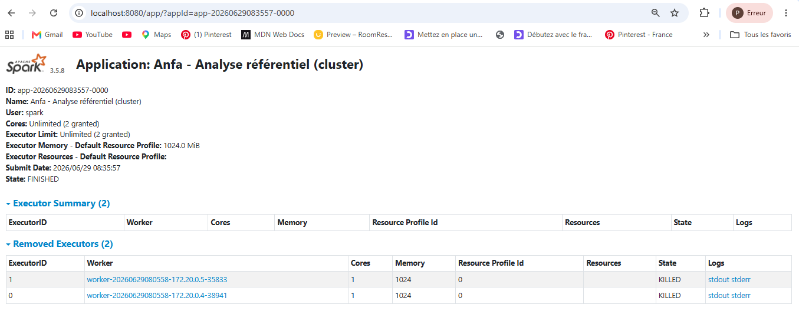
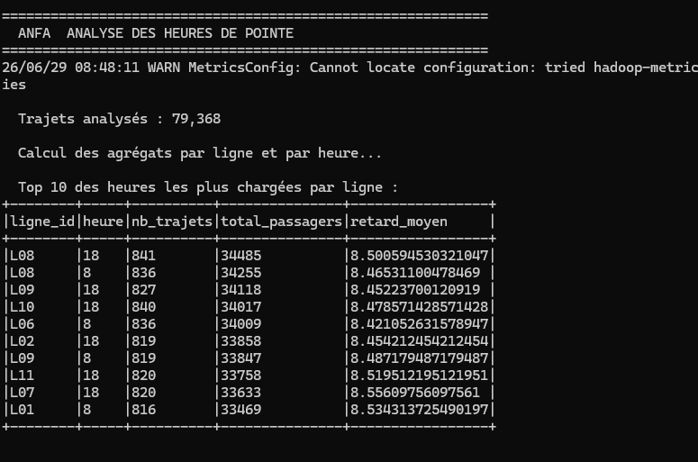
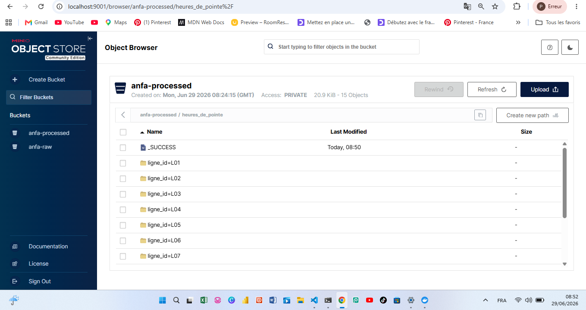

# Rendu Séance 5

**Nom et prénom :**     ADEOUL Koffi Prosper

## Résumé de la séance

Au cours de cette séance, nous avons déployé un cluster Apache Spark autonome (Standalone) à l'aide de Docker Compose et exécuté des jobs PySpark distribués sans utiliser d'RDD. Les données ont été lues directement depuis notre stockage d'objets MinIO, traitées par le cluster, puis réécrites au format optimisé Parquet. Cette expérience nous a permis de concrétiser les notions de parallélisme et de comparer le comportement d'une exécution locale face à un environnement distribué.

## Étapes principales

1. Déploiement du cluster Spark standalone (1 master + 2 workers) via Docker Compose.
2. Préparation de MinIO et upload du référentiel.
3. Premier job distribué (`analyse_referentiel_cluster.py`) : statistiques de base.
4. Génération d'un historique simulé de trajets et job d'analyse des heures de pointe.
5. Comparaison subjective entre mode local et mode cluster.

## Captures d'écran

### Dashboard Spark Master avec 2 workers

### Application Spark exécutée avec succès

### Résultats du Top 10 dans la console

### Bucket anfa-processed avec heures_de_pointe partitionné

## Réflexion : local vs cluster

En termes de rapidité perçue sur de petits volumes de données, le mode local reste plus agile car il n'impose pas le coût de distribution des tâches ni l'overhead de communication réseau entre le Master et les Workers. L'expérience de développement y est plus fluide pour le débogage rapide. En revanche, dès que la volumétrie augmente ou que les transformations deviennent lourdes, le mode cluster prend tout son sens en répartissant la charge de calcul. J'utiliserais le mode local pour les phases de prototypage, de test unitaire et d'exploration de données, et le mode cluster pour le traitement de production à grande échelle (Big Data) et les pipelines de données récurrents.

## Bonus Spark sur Kubernetes

**Réalisé: Oui**

## Difficultés rencontrées

- **Obsolescence des dépôts externes (Erreurs 404 GitHub) :** Lors de la phase de déploiement de l'infrastructure Kubernetes pour le bonus, les URLs officielles du dépôt GitHub du *Spark Operator* avaient été modifiées (fusion de branches en 2026), provoquant des erreurs `404 Not Found`. Cette difficulté a été contournée avec succès en concevant et appliquant des manifestes YAML complets gérés en local.

- **Règles de sécurité strictes des API Kubernetes :** L'application de la ressource personnalisée (CRD) a initialement échoué en raison du mécanisme de protection des groupes d'API de Kubernetes (`metadata.annotations[api-approved.kubernetes.io]: Required value`). Le problème a été résolu en intégrant l'annotation réglementaire d'approbation requise directement au sein des métadonnées du fichier de configuration local.