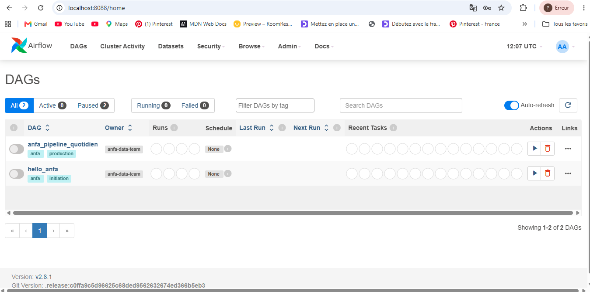
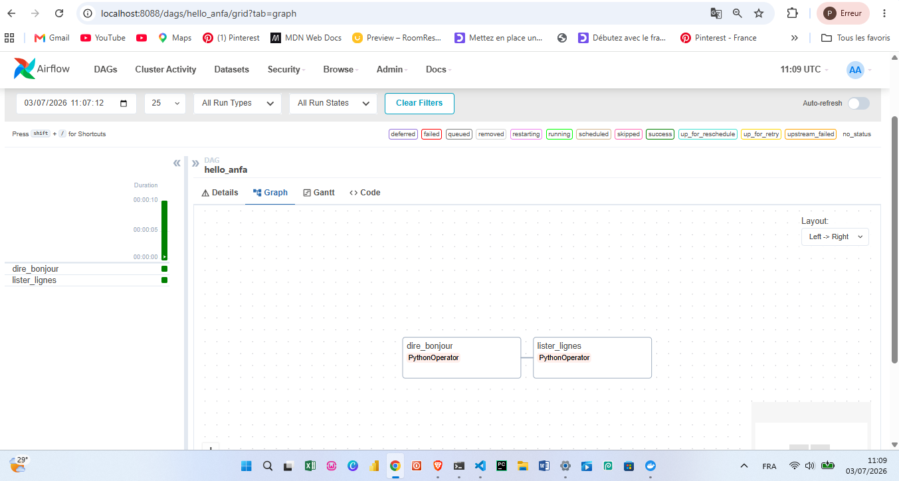
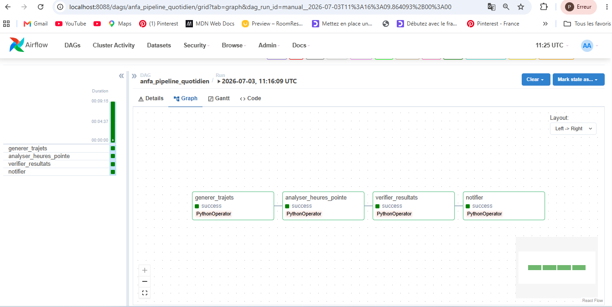
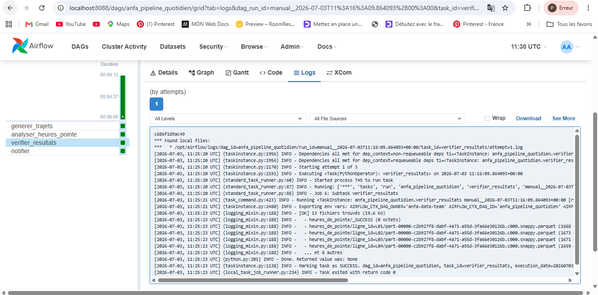
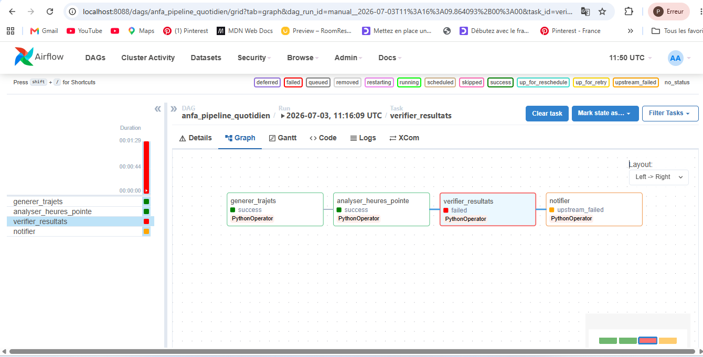

# Rendu : Séance 6

**Nom et prénom :** ADEOUL Koffi Prosper
**Identifiant GitHub :** <prosperadeoul-hub>
**Date de soumission :** <03/07/2026>

## Résumé de la séance

Airflow déployé via Docker Compose aux côtés de MinIO et Spark. Un premier DAG
simple (`hello_anfa`) a servi à comprendre la mécanique, puis un DAG métier
(`anfa_pipeline_quotidien`) orchestre le pipeline de la séance 5 :
génération → analyse Spark → vérification → notification. Les retries et la
propagation d'échec ont été observés via un bug volontaire.

## Étapes principales

1. Déploiement de la stack (Airflow + PostgreSQL + MinIO + Spark) via Docker Compose.
2. Premier DAG `hello_anfa` à 2 tâches : initiation à la mécanique Airflow.
3. DAG métier `anfa_pipeline_quotidien` à 4 tâches : génération → Spark → vérification → notification.
4. Démonstration des retries et de la gestion d'erreur via un bug volontaire.

## Captures d'écran

### UI Airflow après connexion (vue d'accueil)

### DAG hello_anfa exécuté en succès

### DAG anfa_pipeline_quotidien complet en succès

### Logs de la tâche `verifier_resultats`

### Démonstration du retry : tâche en échec et propagation

## Réflexion personnelle

Airflow surpasse un simple cron en gérant intelligemment les dépendances entre les tâches, évitant ainsi de lancer des scripts aveuglément à heure fixe. Il apporte une résilience indispensable en production grâce à ses mécanismes de retries automatiques et sa capacité à relancer uniquement une tâche en échec, **clear**. Son interface graphique centralise le suivi visuel en temps réel et l'accès direct aux logs, ce qui simplifie grandement le diagnostic des pannes. Sur un vrai projet, on l'utilise dès que le pipeline devient complexe et fait intervenir des outils hétérogènes, comme ici en pilotant MinIO et un cluster Spark externe. C'est l'outil idéal pour garantir l'idempotence et la traçabilité de bout en bout lorsque la robustesse des données est critique.

## Difficultés rencontrées

- **Conflit de port avec le PostgreSQL local (Windows) :** Au premier lancement, le conteneur anfa-postgres est tombé en échec car le port 5432 était déjà utilisé par une instance de PostgreSQL installée localement sur ma machine physique.
- **Solution :** La section *ports* a été supprimée du service postgres dans le fichier docker-compose.yml; Airflow communique avec la base de données via le réseau virtuel et interne de Docker en utilisant l'adresse @postgres:5432. Il n'a donc pas besoin que le port soit exposé à l'extérieur. Supprimer cette ligne supprime le conflit avec mon Windows tout en laissant Airflow fonctionner parfaitement en interne.

- **Oubli de capture avant l'arrêt de la stack :** J'avais arrêté l'infrastructure Docker avant d'avoir pu réaliser la capture d'écran demandée pour la page d'accueil d'Airflow. 
- **Solution :** Grâce à la persistance des volumes Docker configurés, il a suffi de relancer la stack avec *docker compose up -d* pour retrouver tout l'historique intact dans l'UI sur le port 8088 et effectuer la capture *airflow-home.png* sans avoir à tout réexécuter.
