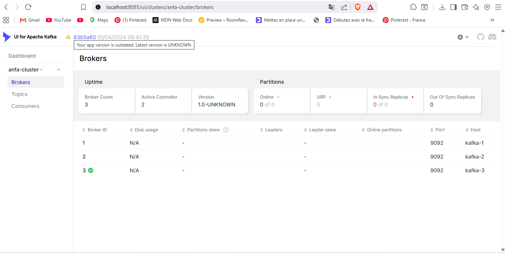
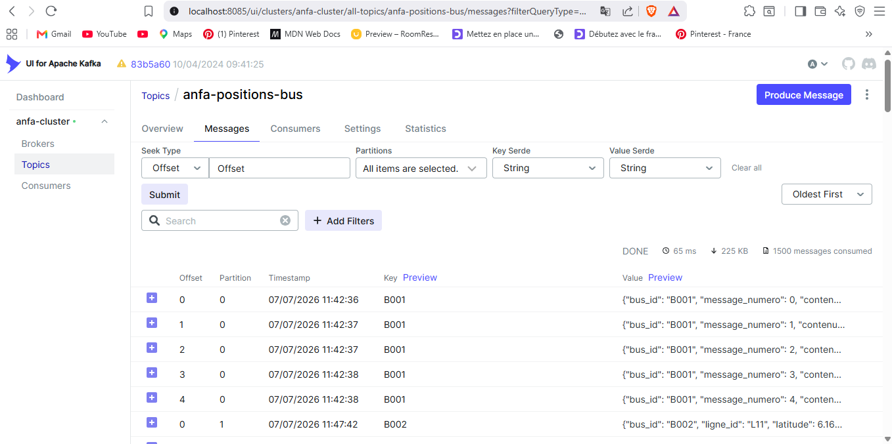
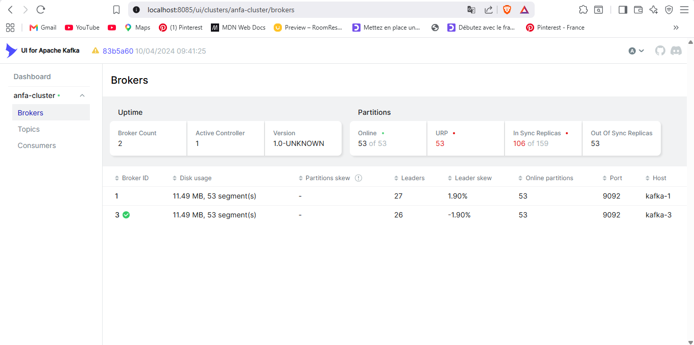
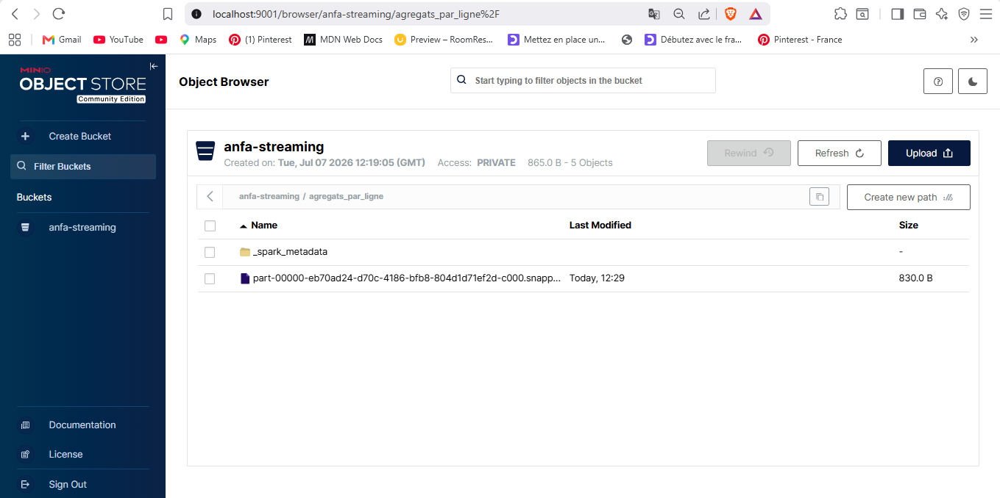

# Rendu — Séance 7

**Nom et prénom :** ADEOUL Koffi Prosper

**Identifiant GitHub :** prosperadeoul-hub

**Date de soumission :** <07/07/2026>

## Résumé de la séance

Lors de cette séance, un cluster Kafka complet composé de 3 brokers a été déployé en mode KRaft pour s'affranchir de Zookeeper. Une flotte de 100 bus Anfa a ensuite été simulée pour publier en continu des positions GPS , ce qui a permis de valider la tolérance aux pannes du cluster lors de la coupure brutale d'un broker. Enfin, Spark Structured Streaming a été utilisé pour consommer ce flux en temps réel afin d'opérer des agrégations temporelles par fenêtres glissantes et d'écrire automatiquement les résultats sur MinIO.

## Étapes principales

1. Déploiement du cluster Kafka (3 brokers, mode KRaft) + Kafka UI.
2. Création du topic `anfa-positions-bus` (3 partitions, réplication 3).
3. Premier producer/consumer Python pour comprendre la mécanique.
4. Simulation de 100 bus envoyant leur position en continu.
5. Démonstration de tolérance aux pannes (arrêt d'un broker).
6. Spark Structured Streaming : lecture console, puis agrégation en fenêtre vers MinIO.

## Captures d'écran

### 3 brokers actifs dans Kafka UI

### Débit de messages en augmentation

### Cluster avec 2 brokers sur 3 (après arrêt volontaire)

### Micro-batchs affichés en console par Spark

### Résultats agrégés dans MinIO

## Réflexion personnelle

Le couplage Kafka + Spark Streaming s'impose dès que la fraîcheur de l'information est critique et requiert une réactivité à la seconde (comme le suivi d'une flotte en direct ou la détection d'alertes immédiates), contrairement au pipeline batch (Airflow + Spark) qui traite les données par blocs à intervalles fixes. Concrètement, la réplication à 3 brokers m'a démontré la haute disponibilité et la résilience de l'architecture : lorsqu'un nœud s'arrête, le cluster réélit instantanément un nouveau leader pour les partitions affectées sans causer la moindre perte de données ni interruption du flux de production.

## Réponses aux exercices d'application

<À compléter d'après les énoncés fournis avec l'assignment.>

## Difficultés rencontrées

- Incompatibilité de syntaxe PowerShell sous Windows : Les commandes multi-lignes fournies dans le sujet utilisaient des antislashs (\) propres aux terminaux Linux/macOS, générant des erreurs de syntaxe dans mon terminal. 
- Solution : Toutes les commandes de soumission spark-submit et de configuration mc ont été réécrites et exécutées sur une seule ligne continue.

- Absence de l'outil grep sous Windows : Lors de la phase d'identification du broker à arrêter, la commande filtrée avec *grep* n'a pas été reconnue par le système. 
- Solution : Utilisation de la commande alternative native Docker via le commutateur *--filter "name=...* pour cibler proprement le conteneur du broker.
