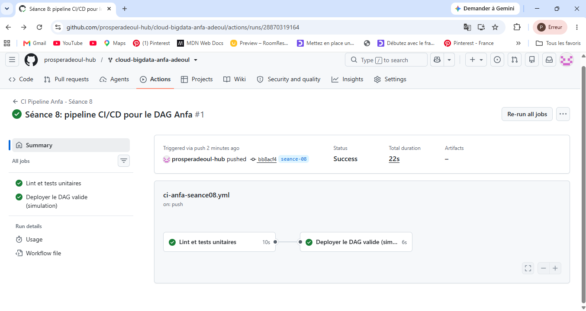
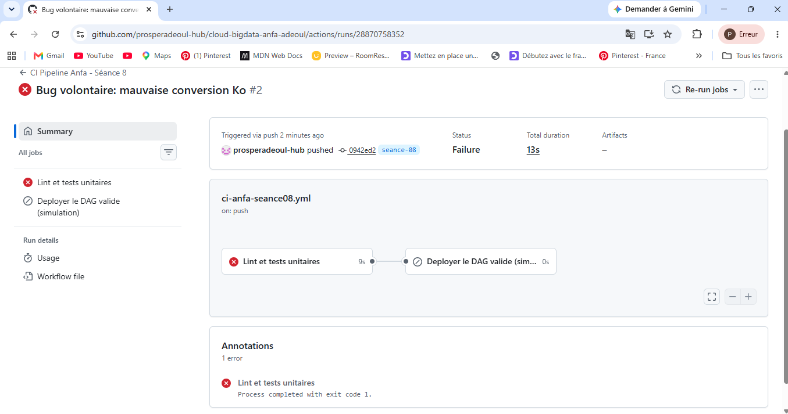

# Rendu — Séance 8

**Nom et prénom :** ADEOUL Koffi Prosper

**Identifiant GitHub :** prosperadeoul-hub

**Date de soumission :** <07/07/2026>

## Résumé de la séance

Lors de cette séance, la logique métier du DAG Airflow a été extraite dans un module Python indépendant afin d'être testée de manière isolée et légère sans installer l'infrastructure d'Airflow. Un pipeline CI/CD automatisé avec GitHub Actions a ensuite été mis en place pour exécuter des étapes de linting et de tests unitaires à chaque push. Enfin, l'introduction d'un bug volontaire a permis de valider que la CI bloque immédiatement tout déploiement en cas de régression, garantissant la sécurité de la production.

## Étapes principales

1. Séparation de la logique métier (`anfa_logic.py`) du DAG Airflow.
2. Écriture de 5 tests unitaires avec pytest.
3. Écriture du workflow GitHub Actions (lint + tests + déploiement simulé).
4. Démonstration : un bug volontaire bloque le déploiement ; correction et succès.

## Captures d'écran

### Workflow réussi (2 jobs)

### Job en échec, déploiement non exécuté

## Réflexion personnelle

Ce pipeline aurait instantanément intercepté l'incident de Mawuli en exécutant la suite de tests automatisés dès son push, détectant l'erreur de conversion avant que le code n'atteigne le serveur de production. Concrètement, le mot-clé *needs: valider-dag* introduit une dépendance stricte : le job de déploiement attend le succès complet du job de validation. Si une seule vérification échoue, le déploiement est automatiquement sauté, agissant comme un garde-fou inviolable.

## Difficultés rencontrées

- Absence de déclenchement initial de la CI sur GitHub : Lors du premier push de la branche, le workflow GitHub Actions ne s'activait pas. 
- Cause et solution : Le déclencheur possède un filtre strict qui exige une modification réelle dans le dossier seance-08. L'édition et l'initialisation du fichier RENDU.md ont permis de déclencher immédiatement le pipeline.
