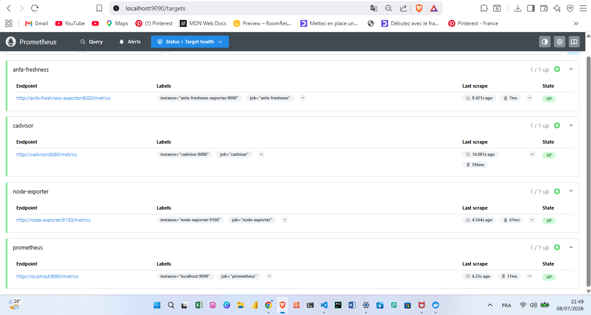
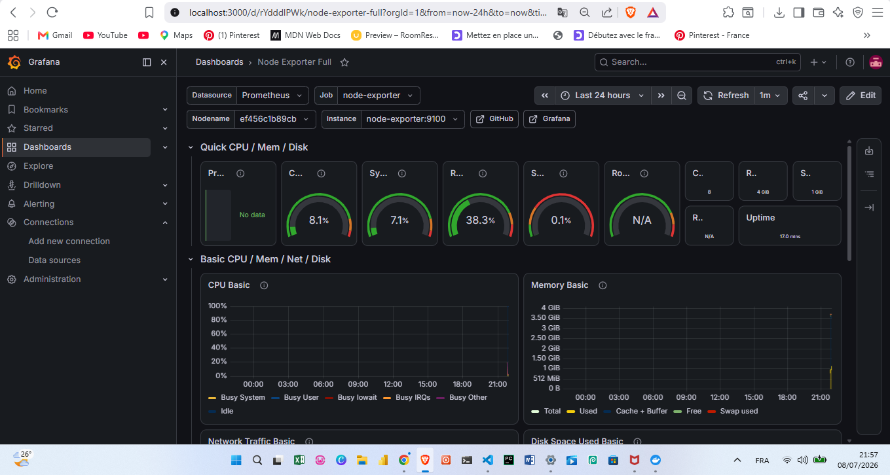
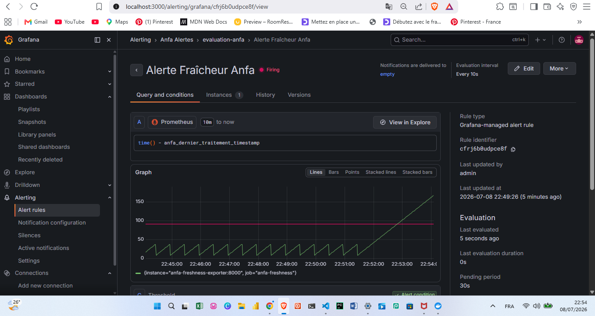

# Rendu — Séance 9

**Nom et prénom :** **ADEOUL Koffi Prosper**

**Identifiant GitHub :** **prosperadeoul-hub**

**Date de soumission :** **08/07/2026**

## Résumé de la séance

Cette séance a permis de déployer une stack complète de monitoring associant Prometheus, Grafana, Node Exporter avec un exportateur métier customisé. Nous avons instrumenté la métrique de fraîcheur des données d'Anfa et configuré une jauge visuelle ainsi qu'une règle d'alerte automatique sous Grafana. Enfin, la simulation d'une panne silencieuse via un fichier sentinelle a démontré l'efficacité du système pour intercepter un incident applicatif invisible sur l'infrastructure.

## Étapes principales

1. Déploiement de Prometheus, Node Exporter, cAdvisor, Grafana et d'un exportateur
   métier custom (fraîcheur des données Anfa).
2. Exploration des cibles Prometheus et premières requêtes PromQL.
3. Import du dashboard "Node Exporter Full" et construction d'un panneau custom.
4. Configuration d'une alerte Grafana sur la fraîcheur des données.
5. Simulation d'une panne silencieuse et observation du déclenchement de l'alerte.

## Captures d'écran

### Les 4 cibles Prometheus à l'état UP

### Dashboard "Node Exporter Full" importé

### Alerte à l'état Firing après panne simulée

## Réflexion personnelle

Cette séance répond directement à la situation-problème d'Awa car elle démontre qu'un système peut être techniquement sain alors que son service métier est totalement interrompu. Là où le CPU, la RAM et le statut des conteneurs indiquaient que tout était "Up" et fonctionnel, seule la métrique de fraîcheur métier a révélé l'anomalie en se figeant et en grimpant de manière continue. Elle permet de passer d'un monitoring purement technique à une véritable observabilité axée sur la valeur et la qualité des données produites.

## Difficultés rencontrées

**Aucune**
